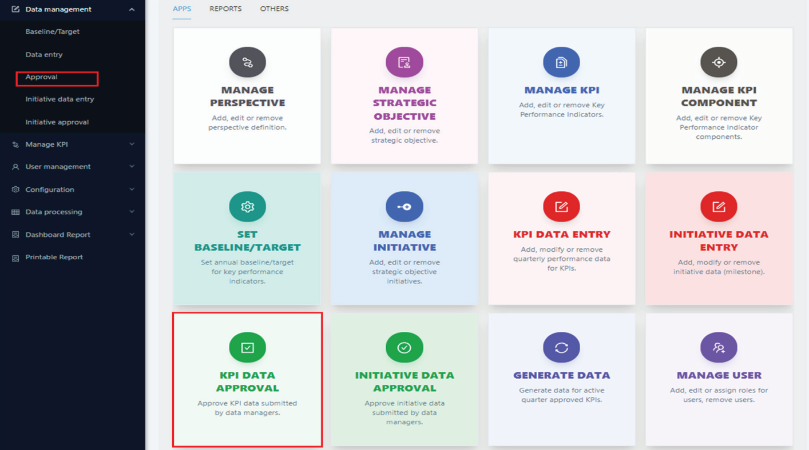
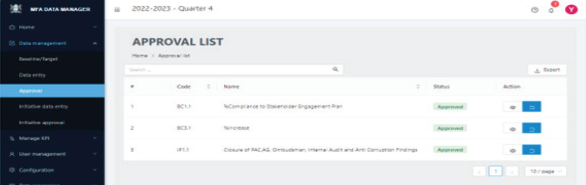
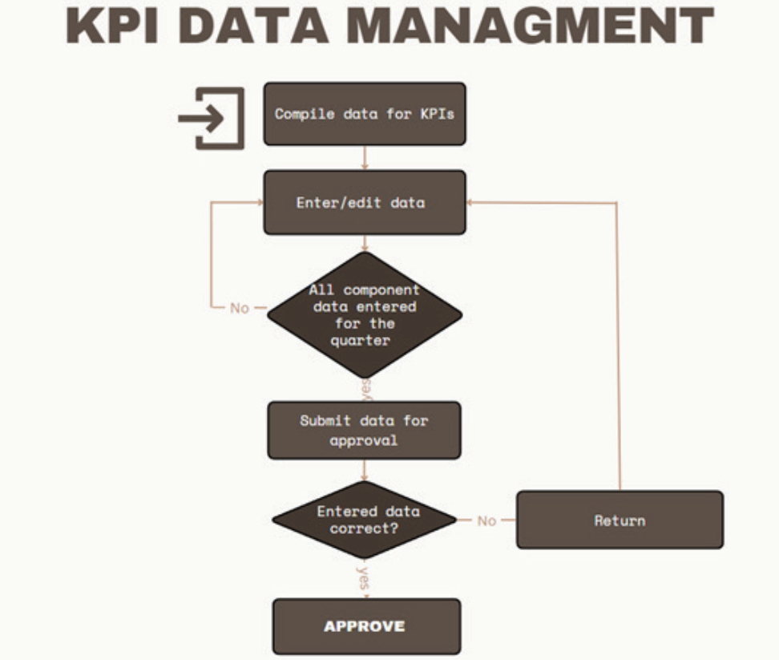

# KPI Data Approvers

## STEP 1

To begin approving data for KPIs, navigate to the dashboard’s home page as illustrated below.

## STEP 2

Select the `Approval` submenu item or click “KPI DATA APPROVAL” card in the APP tab. This action will display the corresponding screen.

## STEP 3

Select the specific KPI for which you intend to approve data. The page will display a list of KPIs assigned to you, showing details such as the KPI code, name, approval status, and available actions. The actions available depend on the current status of each KPI. If a KPI’s data has not yet been approved, click the approval icon in the action column. This action will lead you to the approval screen as shown below.

## STEP 4

The approver has the option to either approve the data or return it for correction using the designated buttons. If the data is being returned for correction, it is mandatory for the approver to include a note explaining the reasons for the return, providing clear guidance to the Data Manager.

