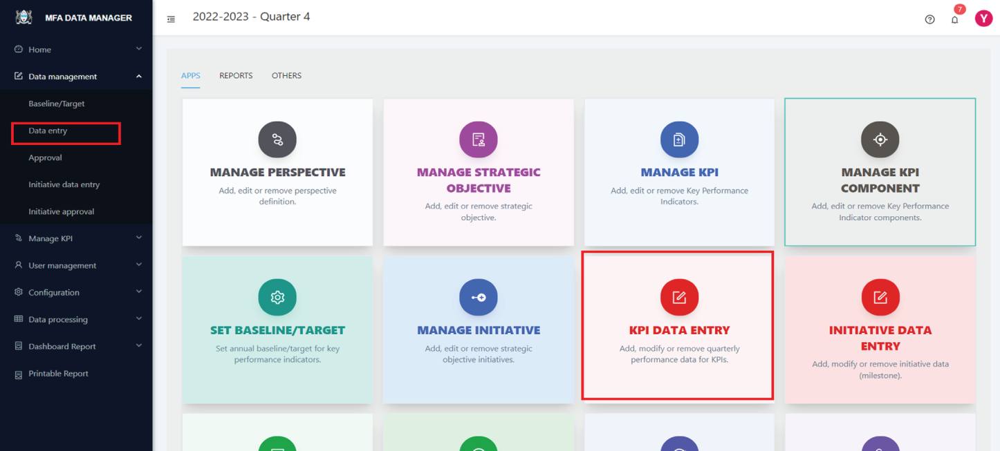
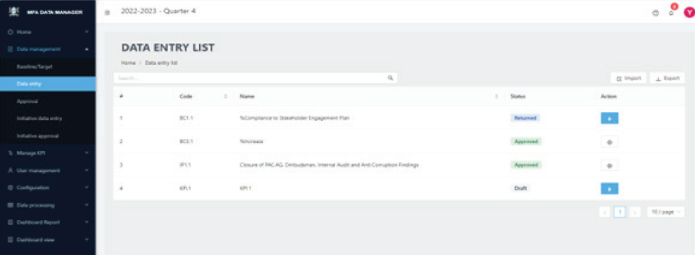
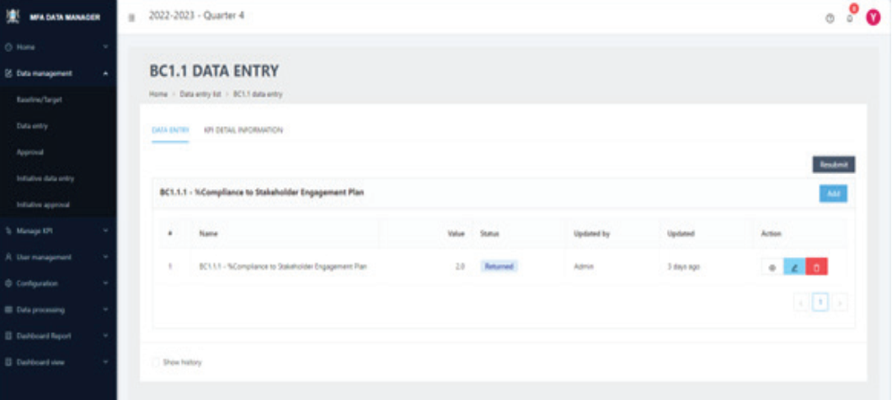
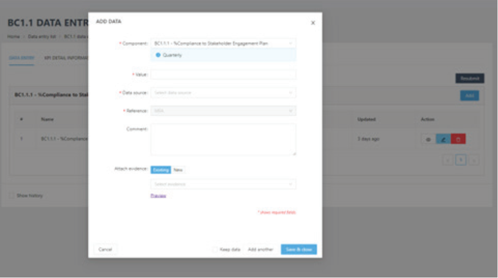

# Data Managers

Data Managers play a vital role within the Performance Dashboard System, specifically assigned the task of routinely gathering data for KPIs from various units within the organization. Their key duty is the accurate and consistent recording of data, a critical component of the dashboard’s functionality. This role is crucial for ensuring the reliability and efficacy of KPI monitoring in the system. While Data Managers have the capability to input data, their access is limited to only those KPIs they are responsible for. This restriction is designed to ensure that data entry is
conducted by those with the requisite knowledge and accountability for specific KPIs, aligning with the respective organizational units they represent. This approach reinforces accuracy and responsibility in data management within the organization.

In the dashboard system, there are two primary types of data that require regular input. The first is the performance data related to Key Performance Indicators (KPIs), and the second comprises initiatives that are aligned with the strategic objectives of the organization.

## KPI data management

### STEP 1

To begin entering data for KPIs, navigate to the dashboard’s home page as illustrated below.

### STEP 2

Navigate to the `Data Management` menu from the dashboard home page and select `Data entry` sub menu or click on the `KPI DATA ENTRY` card in the APP section. This will open the data entry page as shown below.

### STEP 3

Choose the specific KPI for which you wish to enter data by clicking the `+` icon located in the action column. This will open the data entry screen for that particular KPI as shown below.

### STEP 4

Click the `Add` button next to the relevant component to proceed. This action will open a pop-up screen fordata entry as shown below:

Follow the on-screen guides to input the data value, its source, and the relevant organizational unit (select `Organization` if the data is specific to any particular unit). If you have additional information about the data, include it in the comments box. Attach any supporting evidence to validate the data; this is crucial for ensuring its accuracy and enhancing the overall quality of the Dashboard. Such evidence also aids Data Approvers in verifying the accuracy of the data. Once all information is entered, click the appropriate save button at the bottom to permanently save
your entry.