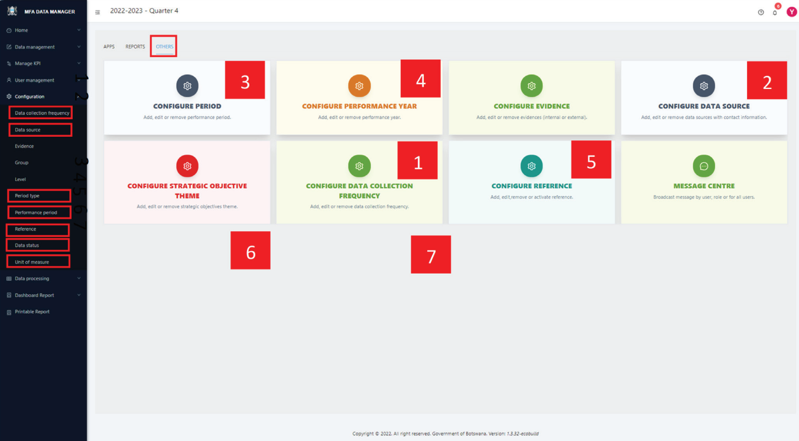
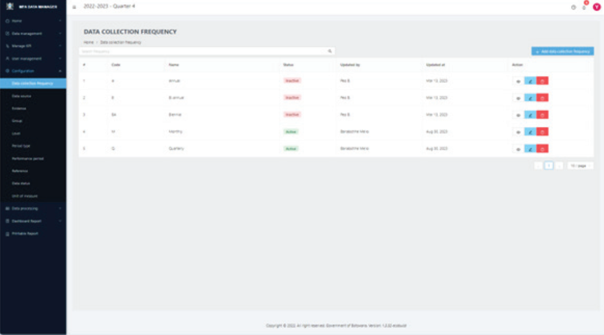
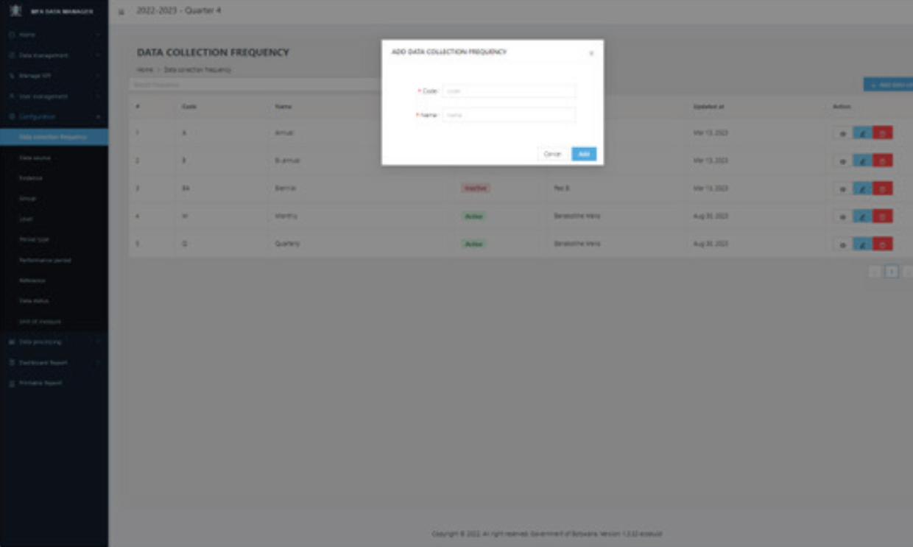

# Configuring Dashboard Variables

Setting up the dashboard for use requires several configurations, which include:

1. **Data Collection Frequency:** This refers to how often KPI data is expected to be collected from sources.
2. **Data Sources:** These are the various origins from which the data is sourced.
3. **Period Type:** This denotes the specific performance period for which the dashboard is set.
4. **Performance Period:** The time frame during which the dashboard operates and monitors data.
5. **Organizational Units (Org Units):** These are the specific segments or departments within the organization
relevant to the data.
6. **Data Status:** This indicates the current stage or condition of the data within the dashboard.
7. **Unit of Measure:** The standard unit in which the KPIs are measured.

Each of these elements plays a crucial role in the effective functioning and accuracy of the dashboard

### STEP 1

To configure the settings mentioned above, click on the “OTHERS” tab to view a list of corresponding apps. Alternatively, you can select “Configuration” from the left side menu. This will display a list of configuration variables as shown below.

### STEP 2

Select the specific configuration you wish to set. For instance, to configure “Data Collection Frequency,” click on its respective menu item or app card. This action will lead you to the screen displayed below.

### STEP 3

To add a new data collection frequency, click the “+ Add data collection frequency” button located at the top right of the page. This action will bring up a new screen, as depicted in Figure 7, where you can enter the required details. After filling in this information, click the “Add” button on the popup to save your entry. You will then be redirected back to the “Data Collection Frequency” page.

On the “Data Collection Frequency” page, you have a variety of functions at your disposal:

  (A) To view an existing entry, click the view icon (👁️‍) located in the action column.
  
  (B) For editing an entry, select the pencil icon (🖉), also found under the action column.
  
  (C) To remove an entry, click the delete icon (🗑️).
  
  (D) Additionally, at the top of the page, there is a search box to help you filter and locate specific entries, making it easier to navigate through them.
  
  (E) If there are more entries than can fit on a single page, you will find page navigation controls at the bottom of the page to help you move through multiple pages.

Configuring the remaining system variables follows a similar pattern. Just select the appropriate menu item to start.
As you become familiar with the configuration process in one section, you’ll find navigating through other sections
increasingly intuitive. While the key difference lies in the specific details required on each page, the overall design
ensures a consistent and user-friendly experience throughout the system
