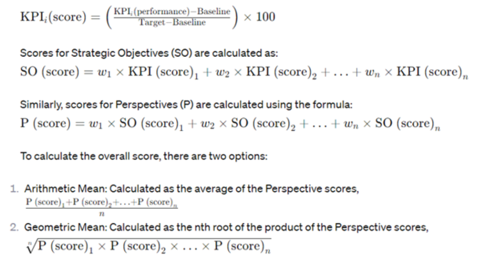
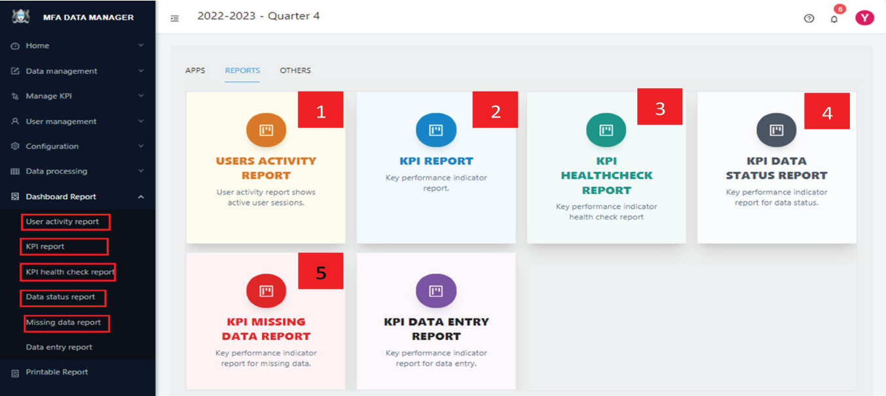
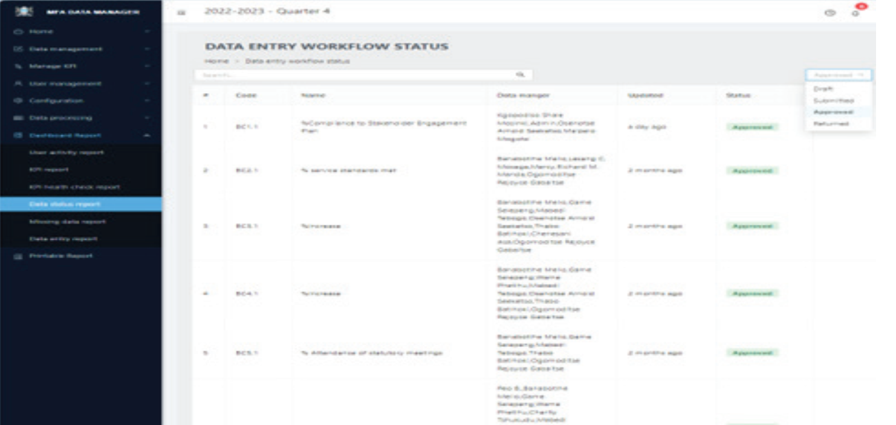
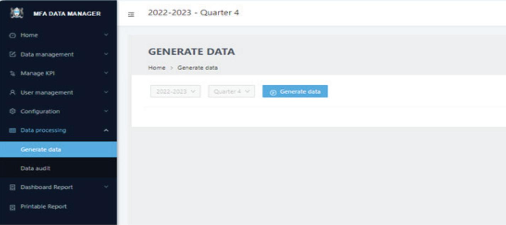
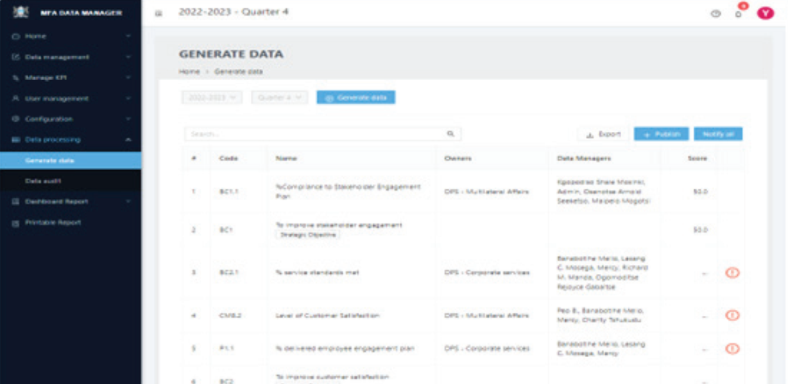
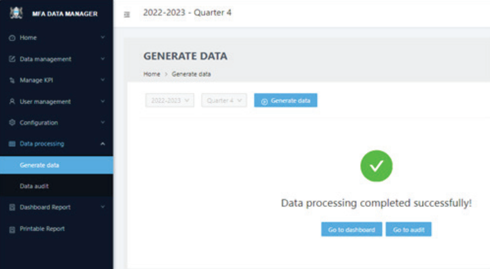

# Quarterly report generation and data processing

The Dashboard Manager’s primary responsibility is overseeing the entire operation of the system. This encompasses ensuring that all KPIs are well-defined, accurately linked to strategic objectives, and in turn, these objectives are aligned with the overarching perspectives. Additionally, the Dashboard manager must verify that there are no missing data for the KPIs and that all data are approved.

The dashboard manager is supported these tasks with a variety of features in the system:

1. **User Activity Report:** Displays active user metrics, including connection details, IP addresses, and last active
times, to monitor user engagement.
2. **KPI Report:** Lists each KPI, associated components, data managers, related strategic objectives, and
corresponding perspectives.
3. **KPI Health Check Report:** Identifies KPIs that lack proper formulation, such as missing user assignments,
owners, components, or formulas.
4. **Data Status Report:** Details the status of KPI data, including categories like draft, submitted but not approved,
returned for correction, and approved.
5. **Missing Data Report:** Highlights KPIs with missing data, necessary for further processing.

After all is fine, the Dashboard Manager generates scores at all levels and communicates the results to management. This data processing step involves calculating KPI scores from the submitted component data, then consolidating these scores to assess the performance across various perspectives, resulting in an overall performance score for the organization.

The formula used ensures that KPI scores are standardized into a percentage unit, facilitating the aggregation of all KPIs into a single, unified metric for comparison and analysis.

:::note Standardized KPI scores

$$KPIi (performance)= (f(∑ Component i,j) )$$
:::

The performance of $$ KPI i $$, denoted as $$ KPIi (performance) $$, is determined by $$ f(∑Component I,j ) $$, where f is a function that processes the components specific to KPIi according to the formula specified in the KPI settings.

The symbol $$ ∑ $$ signifies the sum of all data entered for the component in the performance quarter. Component $$ i,j $$ represents each individual component associated with $$ KPIi $$, where $$ j $$ ranges from $$ 1 $$  to $$ n $$, with n being the total number of components related to $$ KPIi $$.

All KPIs are transformed into standard scores for aggregation and calculation of strategic objectives. The standard score for a KPI is calculated using the following formula:

## To generate quarterly reports using the dashboard, please follow these steps

### STEP 1

Review the dashboard manager reports listed above. To access the reports, click the `Reports` tab to view the available applications. Alternatively, selecting “Dashboard Report” from the left side menu will present a series of menu items, as illustrated below:

### STEP 2

Select the specific report you wish to view. For instance, to view `Data status` click on its respective menu item (3) on the left side show above or the corresponding app card. This action will lead you to the screen displayed below.

The report page empowers the Dashboard Manager with several key functionalities:

(A) It enables the manager to notify data managers and approvers about observed issues. For instance, in
cases of unapproved data, a “Notify” button at the top of the page can be used to send alerts, either
individually or to all data approvers with pending approvals in their queue.

(B) A search box is conveniently located at the top of the page, allowing for easy filtering and quick location
of specific entries, thus enhancing navigation.

(C) For extensive lists exceeding a single page, page navigation controls are available at the bottom,
facilitating seamless movement through multiple pages of entries.

### STEP 3

After ensuring that all data is correctly captured and everything is set up appropriately, the Dashboard Manager should select `Generate data` from the left submenu under the `Data Processing` group on the dashboard home page. This feature is also accessible through the `APPS` tab, where it’s presented as the “Generate data” card.

### STEP 4

To generate scores for all levels, click the “Generate data” button situated at the top of the screen. This action will process the data as illustrated below.

### STEP 5

The page displays generated data only temporarily. It will also indicate if there are any issues during the processing. If everything is in order, the Dashboard Manager can click `Publish` to save the scores permanently for dashboard use. Any identified issues can be addressed by selecting `Notify all` for broader communication.

### STEP 6

Upon clicking `Publish` and confirming the action, the screen shown in Figure 15 will appear, confirming that the scores have been successfully published and are now ready for use.

