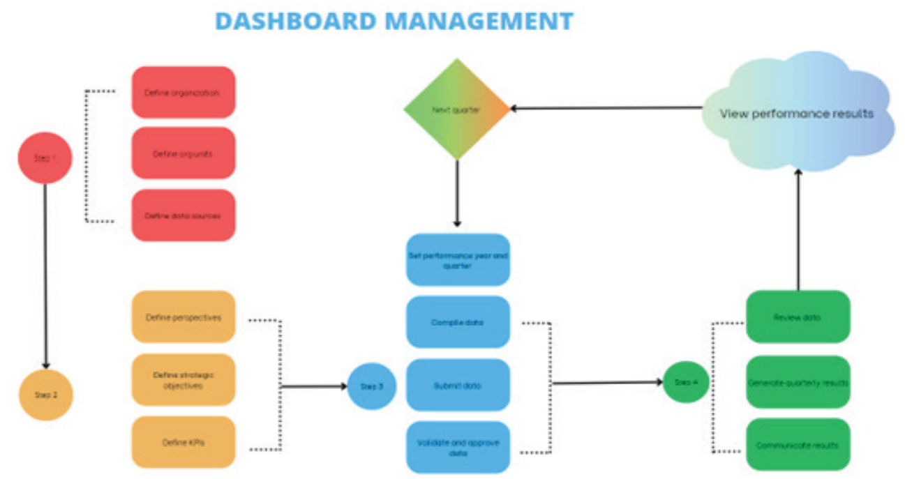

# Manager Dashboard

The Dashboard Manager is key in overseeing the Performance Dashboard System, with responsibilities encompassing:

- Configuring the dashboard’s various settings, including creating KPIs and establishing the appropriate
structure of the dashboard.
- Assessing the system’s structural health, formulas and taking corrective actions.
- Monitoring user activities and engagement.
- Reviewing and identifying missing, unsubmitted, or submitted but unapproved data, and alerting users for appropriate action before processing data and generating results.
- Generating and reviewing KPI reports for accuracy and insights.
- Conducting data audits for integrity and reliability.
- Calculating and generating performance scores from compiled data.
- Publishing the dashboard results quarterly for organizational review.
- Alerting users about the use of reports and dashboard results for actionable decisions.

These roles ensure the Dashboard Manager maintains the system’s effectiveness, health, and accuracy, reflecting the
true performance of the organization.

