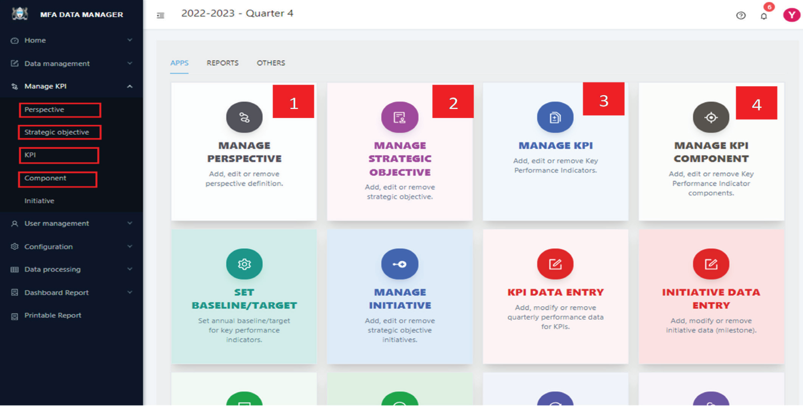
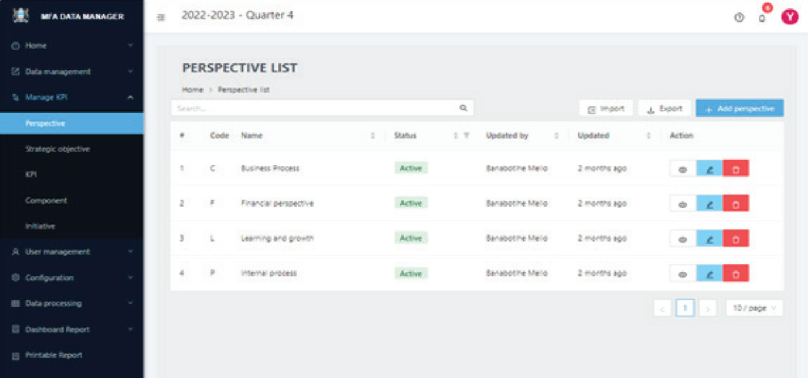
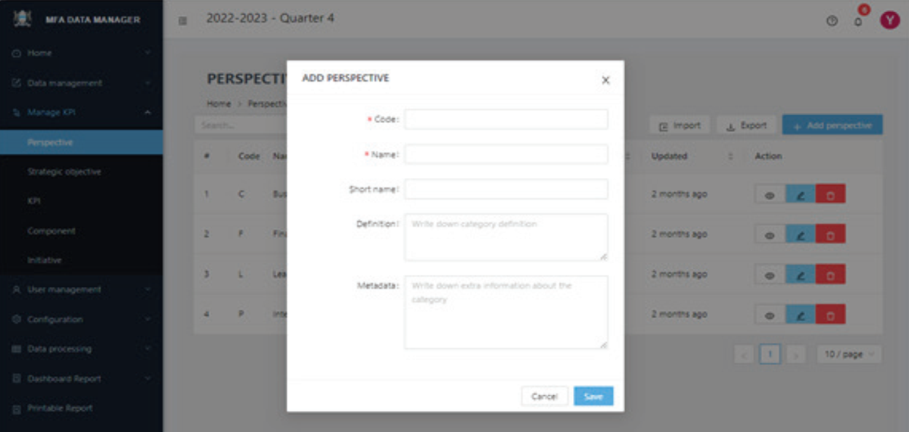

# Setting KPI Structure

KPIs, the fundamental components of a performance dashboard, are meticulously organized under **strategic objectives**, which are in turn grouped into perspectives. These KPIs must be well-identified, specific, measurable, and aligned with the organization’s vision, mission, and objectives.

Additionally, they require defined formulas for their calculation and vertical aggregation into strategic objectives and perspectives. For effective time-based comparison, a longer lifespan for KPIs is crucial.The dashboard structure is defined starting from the top level, with perspectives, then moving down to strategic objectives, and finally to KPIs and its components.

1. **Perspectives:** These are high-level categories or viewpoints from which an organization’s performance is
evaluated. Examples include financial perspective, customer perspective, internal processes, and learning
and growth.
2. **Strategic Objectives:** These are specific goals set within each perspective, aimed at achieving the
organization’s overall strategic plan. They translate the organization’s vision and mission into actionable
goals.
3. **KPIs:** These are measurable values used to evaluate the success in achieving strategic objectives. KPIs provide
quantifiable metrics directly linked to both strategic objectives and perspectives.
4. **Components:** These atomic-level variables are integral for capturing raw data that is essential in measuring KPIs. They include elements like the numerator and denominator, which are necessary for converting a KPI into a percentage or rate, or for deriving KPI results through a formula. The strategic implementation of components in the dashboard system ensures that KPIs are calculated efficiently as rates and percentages internally, thereby streamlining the process. This approach also maintains consistency in data handling and
preserves raw data, which is crucial for purposes of auditing and verification.

## Coding scheme of dashboard structure

Before starting In addition to the hierarchy mentioned previously, a coding scheme has been adopted to uniquely identify KPIs, strategic objectives, and perspectives. This scheme not only facilitates unique identification but also helps in determining the level of a specific measure, both by the system and the users. The application adheres to the following coding structure to ensure the proper functioning of the system:

Perspectives are assigned one letter code. For example, `B` represents the Business Processes Perspective.

1. Strategic objectives are identified by incorporating the code of the perspective they belong to, followed by an
additional letter representing the objective measure, and a digit from 1 to n, denoting the count of objectives.
For instance, `BC1` might signify the first Customer Satisfaction strategic objective.
2. KPIs under strategic objectives will adopt their respective strategic objective’s code, followed by a decimal point
and a sequential number. For example, `BC1.1` denotes the first KPI under the Customer Satisfaction objective.
3. Components under KPIs will use their parent KPI’s code plus a decimal point and a sequential number. For example, `BC1.1.1` refers to the first component under the first KPI of Customer Satisfaction.

In defining the structure, it is crucial to strictly adhere to this coding scheme, as the dashboard utilizes these codes to identify and map the relationships within the hierarchies. The precise use of these codes is essential for the accurate functioning of the system, ensuring that each element – whether a perspective, strategic objective, KPI, or component – is correctly classified and linked within the overall framework. This systematic approach aids in maintaining clarity and consistency across the dashboard, facilitating effective tracking, analysis, and reporting of
the respective scores.

For details please refer annex I

### STEP 1

To begin defining the dashboard structure, click the “APPS” tab to view the available applications. Alternatively,
selecting “Manage KPI” from the left side menu will present a series of menu items, as illustrated below:

### STEP 2: 

Select the specific structure you wish to define. For instance, to define `Perspectives` click on its respective menu item on the left side show above or the corresponding app card. This action will lead you to the screen displayed below.

### STEP 3: 

To create a perspective, click the `+ Add perspective` button located at the top right of the page. This action will bring up a new screen, as depicted in Figure 10, where you can enter the required details. After filling
in this information, click the `Add` button on the popup to save your entry. You will then be redirected back to the
“Perspective definition” page.

On the [Perspective definition](#step-2) page, you have a variety of functions at your disposal:

(A) To view an existing entry, click the view icon (👁️) located in the action column.

(B) For editing an entry, select the pencil icon (🖉), also found under the action column.

(C) To remove an entry, click the delete icon (🗑️).

(D) Additionally, at the top of the page, there is a search box to help you filter and locate specific entries, making it easier to navigate through them.

(E) If there are more entries than can fit on a single page, you will find page navigation controls at the bottom of the page to help you move through multiple pages.

The procedure for defining strategic objectives, KPIs, and Components is quite similar. Simply choose the relevant
menu item to begin. You will notice that once you are accustomed to the process in one area, navigating the others
becomes much more intuitive. The key difference in each page is the specific information you need to input, but the
overall user experience is designed to be uniform and user-friendly.