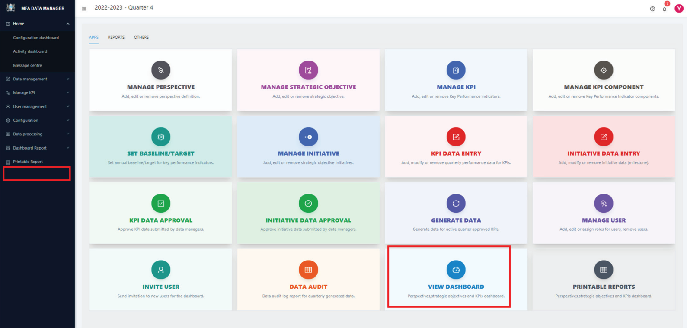
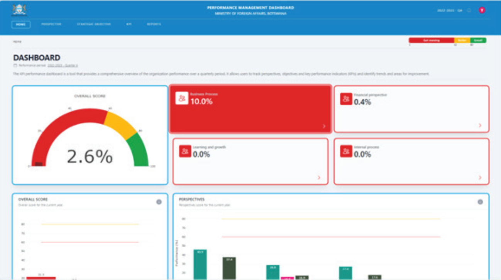
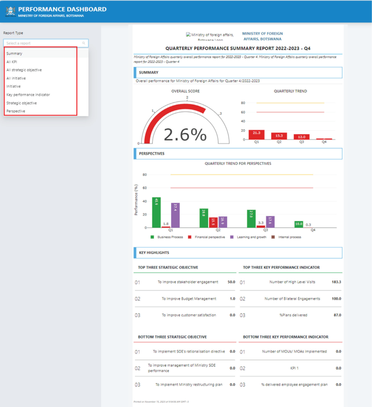

# Users Dashboard

The goal of the dashboard to effectively communicate performance scores across all organizational levels to both management and staff. This facilitates informed decision-making and ongoing monitoring and improvement. By presenting these scores, the dashboard serves as a vital tool for highlighting areas of strength and pinpointing opportunities for improvement. It plays a crucial role in aligning organizational efforts with strategic objectives and helps in fostering a culture of continuous improvement.

As the dashboard is an internal system, it requires proper authentication to ensure data security and confidentiality.
Only those users who have been assigned the `Dashboard Viewer` role are authorized to access and view the performance scores.

## STEP 1

To view the dashboard, type the URL for the dashboard viewer. Alternatively, you can select the Dashboard view submenu from the `VIEW DASHBOARD` card from the APP list indicated above. This will display the dashboard home page like the one below.

The dashboard is designed to present results in a clear and logical manner. On the home page, it displays the overall performance of the organization using a gauge, and breaks down further into scorecards for each perspective. This layout provides a concise snapshot of the organization’s quarterly performance.

Clicking on a perspective leads to its associated strategic objectives and more detailed views. The user interface is intuitively designed for easy navigation through these various layers of information.

Additionally, users have the capability to view and analyze quarterly performance trends at different levels, including
perspectives, strategic objectives, and KPIs. Detailed raw data is also accessible for a comprehensive understanding
of the performance scores.

## Printer-friendly quarterly reports

Alternatively, the dashboard also offers printer-friendly formats for reports, providing performance scores at all levels. This feature caters to those who prefer to have printed copies or need to archive the results for future reference.

To access these reports, follow these steps:

### STEP 1

Access the reports menu from the left side menu on the dashboard. Alternatively, you can choose the `PRINTABLE REPORT` card from the APP list as mentioned above. Selecting either of these options will display a list of available reports in a format suitable for  printing.

### STEP 2

Select the desired report by clicking its link on the left, as illustrated in the screen above. The report will
initially be displayed on your screen. From there, you have the option to print it if necessary.
