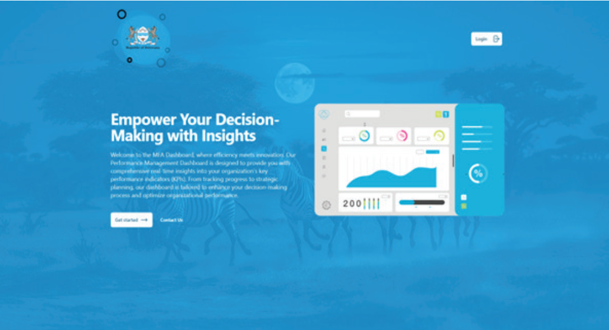
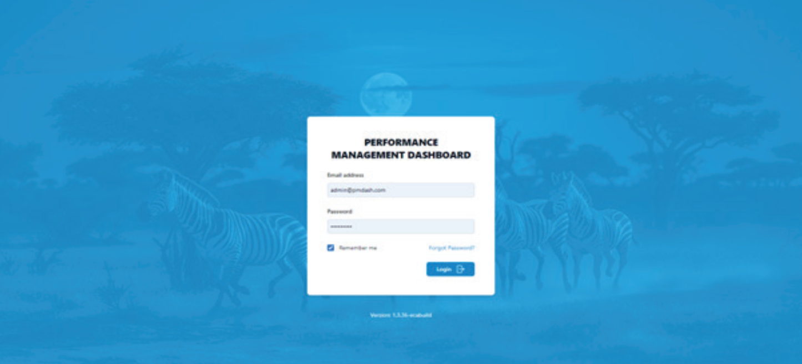
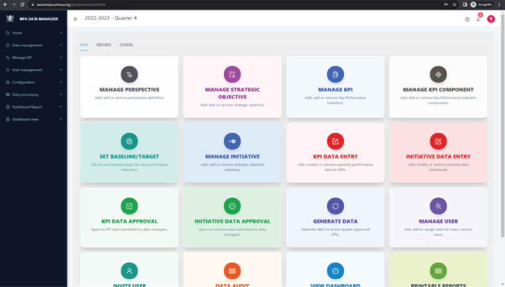
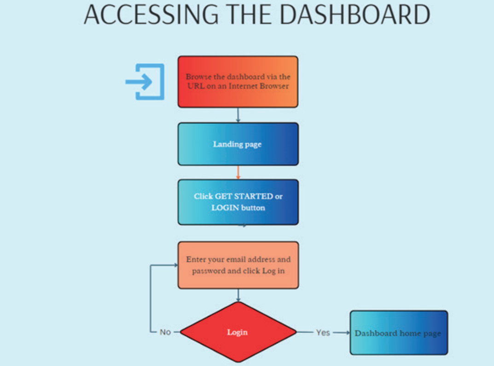

# How to access the dashboard

The Performance Management Dashboard System is an internal, web-based application that can be accessed via the internet browser.

:::info[access info]

For enhanced security, each user is required to log in using a unique username and password.

:::

This system,
designed for internal organizational use, is accessible only through specific invitations.

- As a potential user, you will
receive an email invitation from the dashboard manager to join the system.
- Upon receiving this invitation, you will
be guided to register by entering your personal details and creating a password.
- Once you complete the registration
process and agree to the terms of use, you will be able to start using the Performance Dashboard System.

### STEP 1

- Enter the URL into your browser’s address bar. This will direct you to the main landing page of the application, as illustrated below.

### STEP 2

- To login, please click on either the `Login` or `Get Started` buttons displayed on the above-mentioned landing
page. This action will lead you to a new screen where you’ll be prompted to enter your login credentials.

### STEP 3

- Enter your username and password in the designated fields to log into the system. Upon successful login, you will be directed to the page depicted below.

The home page of the dashboard presents a list of applications, each aligned with the user’s assigned permissions.

1. Users with the `Dashboard Users` role, for example, have access limited to functions like `View Dashboard` and `Printable Reports`.

2. Those assigned the `Data Manager` role will find options primarily focused on data entry.

3. Users in the `Data Approver` role will find options focusing on validation and approval submitted by data managers.  

4. Users assigned the `Data Approver` role will find options specifically centred on validating and approving  data submitted by `Data Managers`.

5. Users in the `Dashboard Manager` and `System Manager` role have the privilege to view all available options.

This structured segmentation is intentionally designed to guide users to the specific functions relevant to their role, ensuring efficient use of the system while minimizing unnecessary exposure to its broader functionalities.

